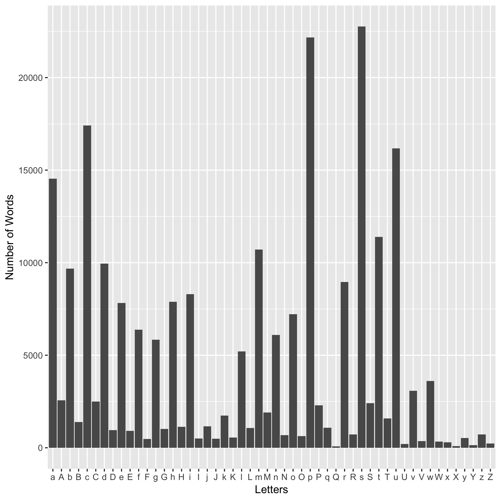
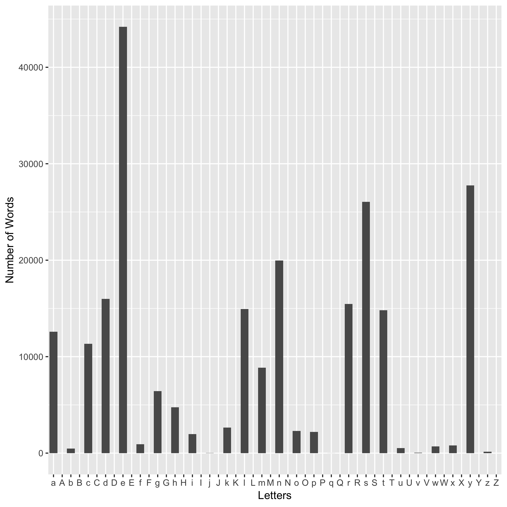
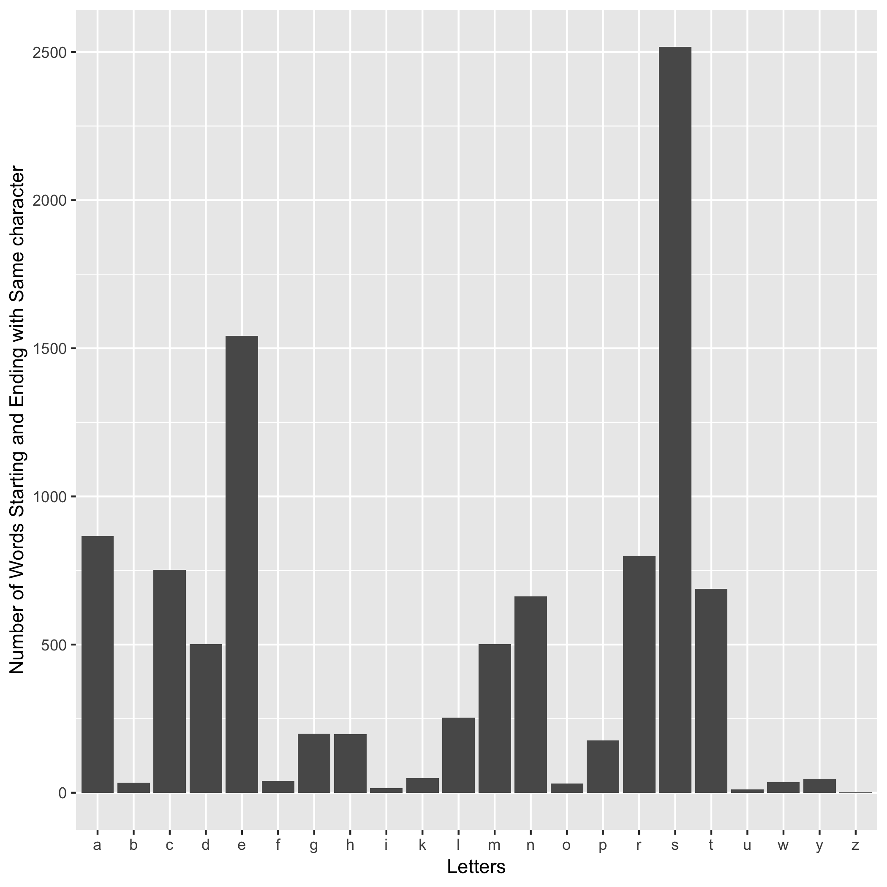

### Functions 

In this automated data-analysis pipeline, I added three simple analysis.

* **Count up the words starting with each character**

* **Count up the words ending with each character**

* **Count up the words starting and ending with same character**

### Count up the words starting with each character

* [first.R](first.R)

* [first_plot.R](first_plot.R)

The tsv file produced by first.R script is found [here](tsvdata/firstletter.tsv)

The plot produced by first_plot.R is shown below.

From the plot, words starting with **s** is most frequent. 

### Count up the words ending with each character

* [last.R](last.R)

* [last_plot.R](last_plot.R)

The tsv file produced by last.R script is found [here](tsvdata/lastletter.tsv)

The plot produced by last_plot.R is shown below.

From the plot, words ending with **e** is most frequent.

### Count up the words starting and ending with same character

* [startandendwithsamecharacter.R](startandendwithsamecharacter.R)

* [startandendwithsamecharacter_plot.R](startandendwithsamecharacter_plot.R)

The tsv file produced by startandendwithsamecharacter.R script is found [here](tsvdata/StartandEndwithSameCharacter.tsv)

The plot produced by startandendwithsamecharacter_plot.R is shown below.

